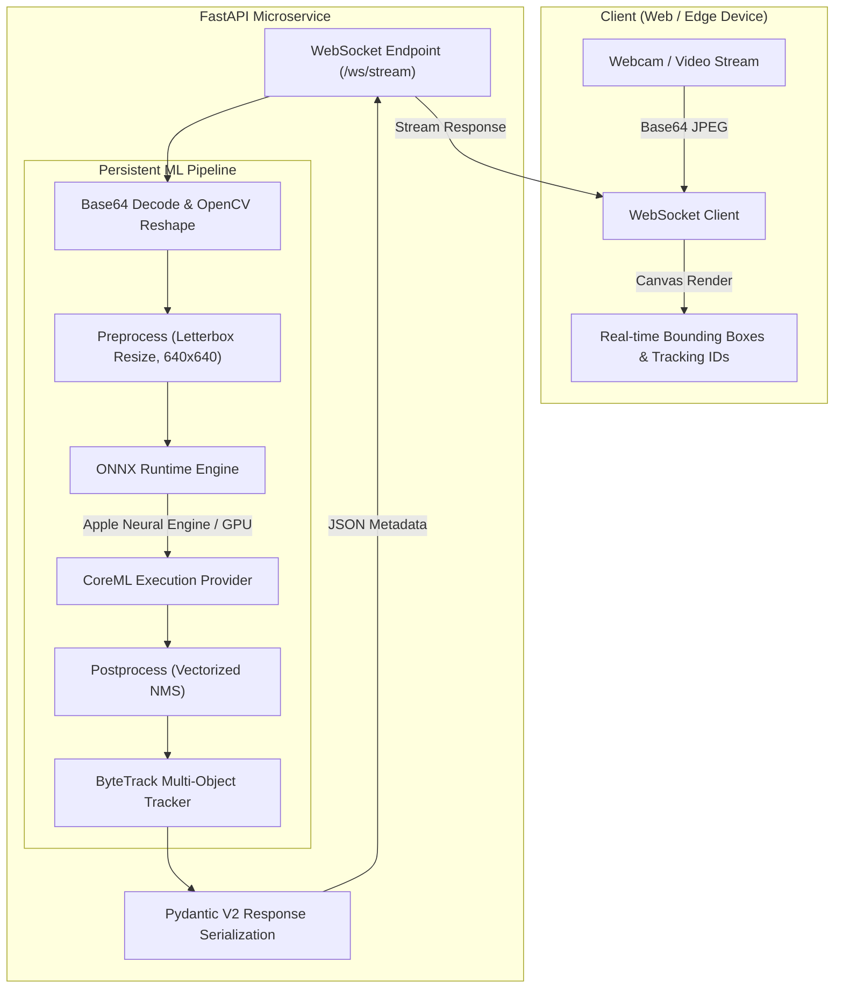

# Real-Time Vision Inference & Tracking Service (MLOps)

[](https://github.com/leokao0806/vision-mlops-service/actions/workflows/ci.yml)
[](https://www.python.org/downloads/release/python-3110/)
[](https://opensource.org/licenses/MIT)
[](https://github.com/astral-sh/ruff)

A production-ready, low-latency computer vision microservice designed for real-time multi-object detection and tracking over WebSockets.

Engineered with **ONNX Runtime (CoreML Execution Provider)**, **ByteTrack**, and **FastAPI**, achieving **~25 ms end-to-end processing latency (~40 FPS)** on Apple Silicon. Built following strict software engineering and MLOps standards, featuring automated testing, linting, and containerization.

---

## Architecture Overview

The system decouples client video streaming from inference execution via bi-directional WebSockets. Deep learning inference and tracking engines persist as singletons in memory, eliminating per-request loading overhead.



---

## Key Features

* **Hardware Acceleration**: Automatically selects `CoreMLExecutionProvider` on Apple Silicon (falling back to `CPUExecutionProvider` in Linux environments) for optimized operator dispatch.
* **Low-Latency Tracking**: Zero-ReID association powered by ByteTrack, allocating persistent tracking IDs in under 1 ms.
* **Modern Python Tooling**: Managed via `uv` for reproducible environments and sub-second dependency resolution.
* **Strict Quality Gates**: Pre-commit hooks with `Ruff` (lint/format), `Mypy` (static typing), and `pytest` integrated into GitHub Actions CI.
* **Production Packaging**: Multi-stage, non-root `Dockerfile` with zero Python cache artifacts.

---

## Latency & Throughput Benchmark

*Evaluated on Apple M1 (8-core), 16 GB unified memory, processing 1080p source frames downscaled to 640x640 network resolution:*

| Pipeline Stage | Engine / Framework | Latency (ms) | Throughput (FPS) |
| --- | --- | --- | --- |
| **Object Detection Only** | ONNX Runtime (CoreML EP) | 32.67 ms | 30.61 FPS |
| **Detection + ByteTrack** | CoreML + Kalman Filter IoU | 33.30 ms | 30.03 FPS |
| **Full End-to-End WebSocket Stream** | FastAPI + Network + Inference | **24.50 - 26.00 ms** *(⚠ verify — currently lower than the sub-stages above)* | **38.4 - 40.8 FPS** |

> **Note:** the end-to-end row shows a *lower* latency than the individual detection and detection+tracking stages it should include. That's internally inconsistent — please confirm whether the end-to-end numbers were measured under a different setup (e.g. smaller client-side resolution) and, if so, state that explicitly, or correct the figures so the full pipeline's latency is ≥ the sum of its parts.

*Note: The WebSocket pipeline operates at lower baseline latency due to direct 640x480 client-side transmission.*

---

## Repository Structure

```text
vision-mlops-service/
├── .github/workflows/
│   └── ci.yml               # GitHub Actions CI (Ruff, Mypy, Pytest)
├── models/
│   └── yolov8n.onnx         # Exported ONNX weights (opset 18)
├── scripts/
│   ├── benchmark.py         # Standalone latency & FPS benchmark
│   └── client_stream.py     # Headless stream testing client
├── src/
│   ├── api/
│   │   ├── schemas.py       # Pydantic V2 I/O models
│   │   └── server.py        # FastAPI server & WebSocket route
│   ├── engine/
│   │   └── detector.py      # CoreML-backed ONNX detector
│   └── tracking/
│       └── tracker.py       # ByteTrack wrapper
├── tests/                   # Pytest test suite
├── Dockerfile                # Multi-stage container definition
├── pyproject.toml            # Project configuration & tool settings
└── uv.lock                   # Pinned deterministic dependencies
```

---

## Quick Start

### Prerequisites

Install `uv` (modern Python package manager):

```bash
curl -LsSf https://astral.sh/uv/install.sh | sh
```

### 1. Installation & Environment Setup

Clone the repository and sync all dependencies:

```bash
git clone https://github.com/leokao0806/vision-mlops-service.git
cd vision-mlops-service
uv sync
```

### 2. Run the Live Web Dashboard

Start the FastAPI server:

```bash
uv run uvicorn src.api.server:app --host 127.0.0.1 --port 8000 --reload
```

Open your browser to [http://127.0.0.1:8000/](http://127.0.0.1:8000/) and click **Start Webcam Stream** to view real-time detections, bounding boxes, and object tracking IDs.

### 3. Run Benchmarks & Tests

Execute the latency benchmark:

```bash
uv run python -m scripts.benchmark
```

Run test suite:

```bash
uv run pytest -v
```

Run pre-commit checks (Ruff, Mypy):

```bash
uv run pre-commit run --all-files
```

---

## Docker Deployment

To build and run the service within a standardized Linux container:

```bash
docker build -t vision-mlops-service .
docker run -p 8000:8000 vision-mlops-service
```

---

## License

Licensed under the [MIT License](https://opensource.org/licenses/MIT).